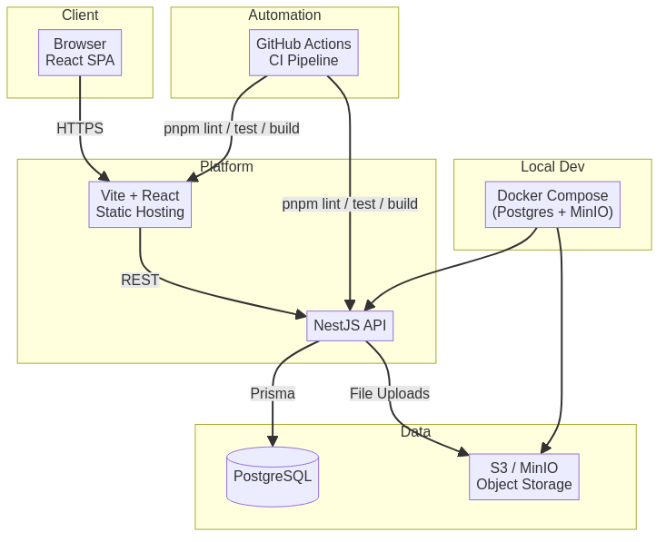
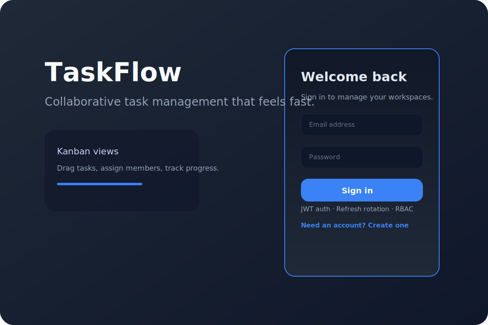
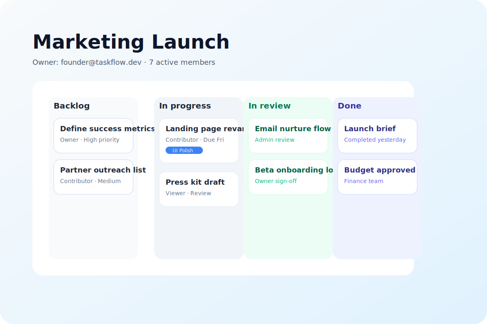

# TaskFlow

Collaborative task management platform built with a NestJS + Prisma backend and a Vite + React frontend.

## Requirements

- Node.js 20.x
- pnpm 9.x
- Docker with Compose plugin

## Getting Started

1. Install dependencies: `pnpm install`
2. Copy environment templates:
   - `cp .env.example .env`
   - `cp apps/frontend/.env.example apps/frontend/.env`
3. Boot the local infrastructure: `docker compose up -d`
4. Generate the Prisma client: `pnpm db:generate`
5. Apply database migrations: `pnpm db:migrate`
6. Seed development data (creates a demo workspace and user): `pnpm db:seed`
7. Review `docs/environment.md` for configuration details before deploying.

Seed user credentials:

- Email: `founder@taskflow.dev`
- Password: `Password123!` (override with `SEED_USER_PASSWORD` when seeding)
- Collaborator email: `collaborator@taskflow.dev` (password `Password123!` or `SEED_COLLABORATOR_PASSWORD`)

### Local Demo Workflow

1. Log into the frontend with the founder account to explore owner permissions.
2. Create a new project via the “New project” button (modal includes optional description).
3. Open an existing project and add tasks with the “New task” modal (set status/priority, assign to members, add due dates).
4. Switch to the collaborator account to verify admin-level access and shared task visibility.
5. Seeded data includes kanban columns populated with sample tasks so the UI renders immediately.

## Running the Apps

- Backend API: `pnpm dev:backend` (serves on `http://localhost:3000/api`)
- Frontend app: `pnpm dev:frontend` (serves on `http://localhost:5173`)

## Architecture

- React SPA served from static hosting calls the NestJS API over HTTPS.
- NestJS layers Prisma over PostgreSQL and streams file uploads to S3-compatible storage (MinIO locally, AWS S3 in production).
- GitHub Actions enforces linting, type checks, migrations, and tests before deploys.

## Product Tour

| Login                                         | Kanban workspace                                      |
| --------------------------------------------- | ----------------------------------------------------- |
|  |  |

The UI flow covers: secure auth, workspace switcher, drag-and-drop kanban updates, inline task role assignments, and file attachments with presigned uploads.

## API Documentation

- Local Swagger UI runs at `http://localhost:3000/api/docs` while the backend is running.
- A committed snapshot lives at `docs/openapi.json`; load it in Swagger UI (e.g. https://editor.swagger.io via File → Import URL with the raw file URL) to explore the API without cloning or booting the app.
- Regenerate the snapshot after API changes with `pnpm docs:openapi`.

## Security Model

- Passwords and refresh tokens are hashed with Argon2 before hitting the database; refresh tokens are single-use and rotated on every login/refresh.
- JWT access tokens (15 min) + refresh tokens (7 days) back REST endpoints via the `Authorization: Bearer` header, with Swagger documenting the requirement.
- Per-project role checks run through a Nest guard that enforces owner/admin/contributor/viewer access before controller logic executes.
- CORS is opt-in for the configured frontend origin only, and Prisma connections defer in tests so the code can boot without a live database.
- Environment variables are cataloged in `docs/environment.md` to simplify hardening by environment.

## Deployment Guide

- `docs/deployment.md` outlines both an AWS-ready path (ECS + RDS + S3 + CloudFront) and a rapid managed-platform option (Render/Railway + Cloudflare Pages). Each includes CI/CD hooks and smoke-test steps post deploy.

## API Surface

- `POST /api/auth/register|login|refresh` – user authentication lifecycle.
- `GET /api/auth/me` – fetch the authenticated profile.
- `GET /api/projects` – list projects for the current user.
- `POST /api/projects` – create a new project owned by the caller.
- `GET /api/projects/:projectId` – retrieve a project with membership validation.
- `PATCH /api/projects/:projectId` – update project metadata (owner/admin roles only).
- `GET|POST /api/projects/:projectId/memberships` – list or invite members.
- `PATCH|DELETE /api/projects/:projectId/memberships/:membershipId` – adjust roles or remove members (owner/admin permissions enforced).
- `GET|POST /api/projects/:projectId/tasks` – browse or create tasks within a project (requires contributor+ roles for write).
- `GET|PATCH|DELETE /api/projects/:projectId/tasks/:taskId` – task lifecycle operations scoped to the project.

## Quality Gates

- Lint: `pnpm lint`
- Unit tests: `pnpm test`
- Type checks: `pnpm typecheck`
- Continuous integration: GitHub Actions runs lint, type checks, database migrations, and tests on every push/PR via `.github/workflows/ci.yml`.

## Tooling Notes

- Local S3-compatible storage is provided through MinIO (exposed on `http://localhost:9000`).
- Update the `.env` files with production-ready secrets before deploying.
- Contribution workflow lives in `CONTRIBUTING.md`; follow it for branch naming, testing, and PR expectations.
- Project is released under the MIT License (`LICENSE`).
